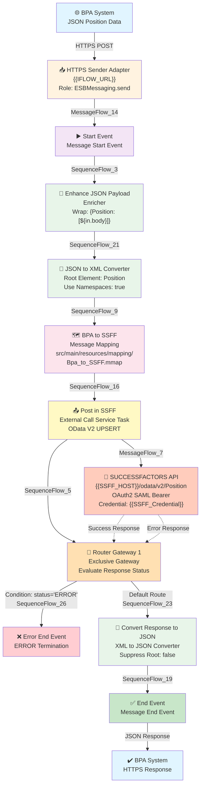

# BPA to SSFF Integration Process Diagram

## Visual Process Flow



---

## Process Flow Explanation

### **1. Initiation: Sender System**
The BPA system sends a POST request via HTTPS to the integration flow endpoint (`{{IFLOW_URL}}`). The request contains position master data in JSON format and requires the `ESBMessaging.send` role for authentication.

---

### **2. Entry Point & Message Reception**
The **HTTPS Sender Adapter** receives the incoming request and triggers the **Start Event**, initiating the message flow processing.

---

### **3. Payload Enrichment**
The **Enhance JSON Payload** enricher wraps the incoming JSON position data into an array structure:
```json
{
  "Position": [
    { /* original position data */ }
  ]
}
```
This standardized format prepares data for downstream transformation stages.

---

### **4. Format Transformation (Phase 1)**
The **JSON to XML Converter** transforms the enriched JSON payload into XML format with `Position` as the root element. Namespace handling is enabled to support complex data structures.

---

### **5. Business Logic Mapping (Phase 2)**
The **BPA to SSFF Message Mapping** applies field-level transformations:
- Maps BPA field names to SuccessFactors OData property names
- Applies data type conversions (dates, numerics, booleans)
- Handles custom field mappings (`cust_*` fields)
- Maintains hierarchical relationships (`parentPosition/code`)
- Processes organizational context (department, cost center, company)

The mapping file is stored at: `src/main/resources/mapping/Bpa_to_SSFF.mmap`

---

### **6. External API Call**
The **Post in SSFF** service task executes an **OData V2 UPSERT operation** against SuccessFactors:
- **Endpoint:** `{{SSFF_HOST}}/odata/v2/Position`
- **Operation:** UPSERT (Insert or Update)
- **Authentication:** OAuth2 with SAML Bearer token
- **Credential:** Referenced from secure store as `{{SSFF_Credential}}`
- **Response:** XML OData response envelope

---

### **7. Intelligent Routing (Critical Decision Point)**
The **Router Gateway 1** (Exclusive Gateway) evaluates the response status:

**Error Path:**
- **Condition:** If `UpsertResponses/PositionUpsertResponse/status = 'ERROR'`
- **Action:** Routes to **Error End Event**, terminating the flow with an error status
- **Impact:** Prevents partial or inconsistent data in SuccessFactors

**Success Path:**
- **Condition:** Default (status ≠ 'ERROR')
- **Action:** Proceeds to response formatting

---

### **8. Response Formatting (Phase 3)**
The **Convert Response to JSON** converter transforms the XML response back to JSON format for the sender system. Root element suppression is disabled to maintain response structure integrity.

---

### **9. Completion & Return**
The **End Event (Success)** returns the formatted JSON response to the BPA system via HTTPS, confirming successful position creation/update in SuccessFactors.

---

## Key Technical Characteristics

| Aspect | Details |
|--------|---------|
| **Protocol Pattern** | HTTPS (inbound) → OData V2 (outbound) → HTTPS (return) |
| **Data Transformation** | JSON → XML → OData V2 → XML → JSON |
| **Mapping Scope** | 19 SuccessFactors position fields + custom fields |
| **Error Handling** | XPath-based response validation with dedicated error path |
| **Retry Strategy** | 1 retry attempt with 1-second timeout on outbound call |
| **Security** | XSRF protection, OAuth2 SAML Bearer token, parameterized credentials |
| **Logging** | All events enabled for comprehensive audit trail |

---

## Message Flow IDs Reference

| Flow ID | Source | Target | Type |
|---------|--------|--------|------|
| MessageFlow_14 | HTTPS Sender | Start Event | Inbound Message |
| SequenceFlow_3 | Start Event | Enhance JSON Payload | Process |
| SequenceFlow_21 | Enhance JSON Payload | JSON to XML Converter | Process |
| SequenceFlow_9 | JSON to XML Converter | BPA to SSFF Mapping | Process |
| SequenceFlow_16 | BPA to SSFF Mapping | Post in SSFF | Process |
| SequenceFlow_5 | Post in SSFF | Router Gateway 1 | Process |
| SequenceFlow_26 | Router Gateway 1 | Error End Event | Conditional (Error) |
| SequenceFlow_23 | Router Gateway 1 | Convert Response to JSON | Conditional (Success) |
| SequenceFlow_19 | Convert Response to JSON | End Event | Process |
| MessageFlow_7 | Post in SSFF | SuccessFactors API | Outbound Message |

---

**Document Version:** 1.0  
**Date Generated:** 2026-05-06  
**Integration:** Create Position from BPA to SSFF
